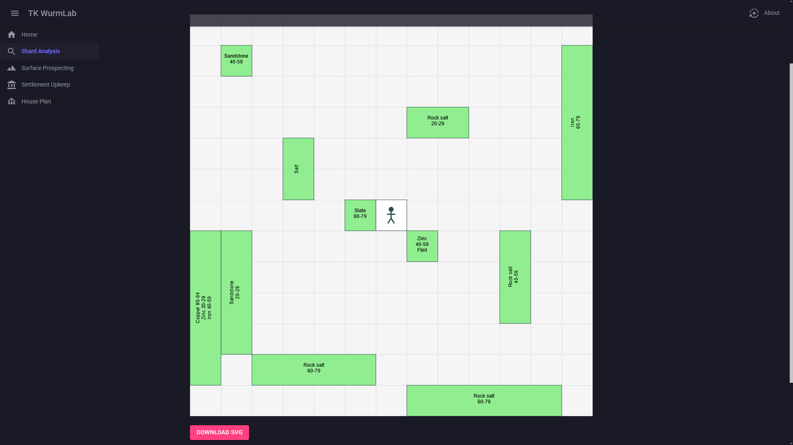
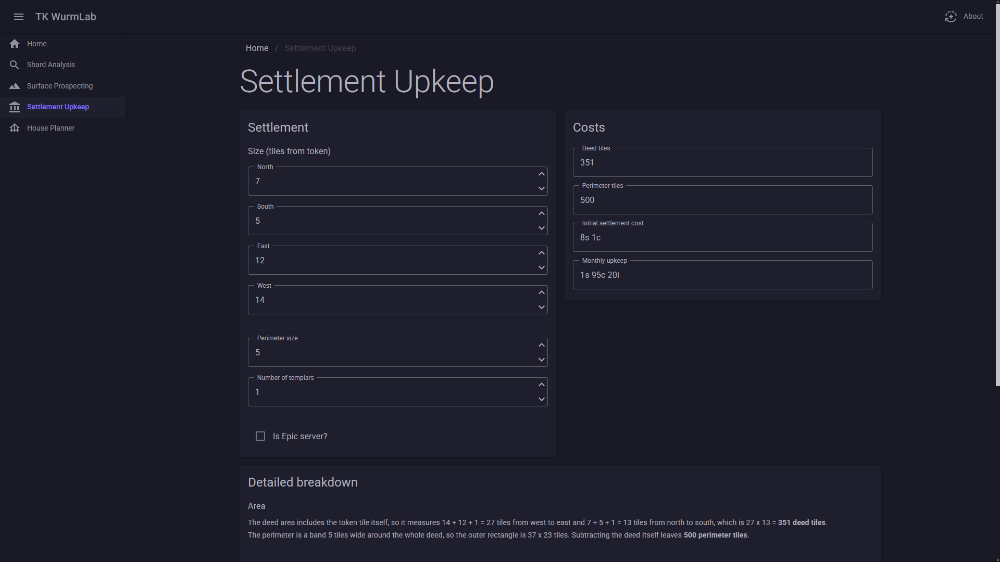
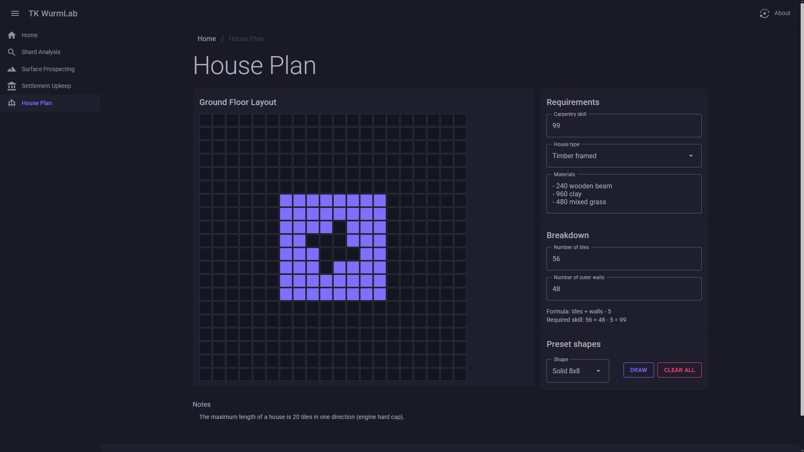

# TK WurmLab

TK WurmLab is a small collection of browser-based tools for [Wurm Unlimited](https://store.steampowered.com/app/366220/Wurm_Unlimited/) and [Wurm Online](https://www.wurmonline.com/) players.

This toolkit modernizes selected community tools into a lightning-fast, ad-free experience powered entirely by client-side [WebAssembly](https://webassembly.org/).

Everything runs locally in your browser. Nothing is uploaded to a server.

## Try It Now

You can use the app directly at [taidanakage.github.io/WurmLab](https://taidanakage.github.io/WurmLab/) — no need to compile or run anything yourself.

## Tools

### Shard Analysis

Visualizes minerals discovered while analyzing shards.

    

### Surface Prospecting

Visualizes minerals discovered while prospecting the surface.

### Settlement Upkeep

Calculates the initial cost, monthly upkeep, and other settlement parameters.

    

### House Planner

Calculates the required skills and materials for ground-floor house plans.

    

### Other

Coming soon.

## Disclaimer

TK WurmLab is an unofficial fan-made project.

It is not affiliated with, authorized, maintained, sponsored, or endorsed by Code Club AB or Game Chest Group AB. 

Wurm Unlimited is a trademark and copyright of Code Club AB. All rights reserved.

## Tech Stack

- .NET 10
- Blazor WebAssembly
- MudBlazor

## AI Disclosure

Most of this source code was generated with the assistance of Claude AI.

## License

This project is licensed under the [MIT License](LICENSE).
